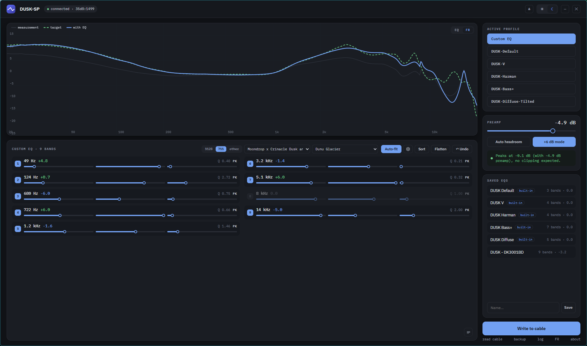

# FreeDSP Studio

An EQ editor for Moondrop's DSP USB-C cables (DUSK-SP, MAY and FreeDSP). It reads whatever EQ is on the cable, lets you edit the 9 parametric bands by dragging points on the response curve, imports from squig.link, and writes it back. Built in Rust with Tauri, so it's a few MB of native app rather than a bundled browser. Runs on Windows and macOS.

I made this because the stock app is clunky, locked to whole-dB steps, and it turns out the cable can do WAY more than the app lets on.

> Independent project. Nothing to do with Moondrop, not affiliated, not endorsed. For cables you own.



## Download

From the [latest release](https://github.com/EffectiveEquivalent/FreeDSP-Studio/releases):

| | | |
|---|---|---|
| **Windows** | `FreeDSP-Studio.exe` | Single portable exe, nothing to install |
| **macOS** | `FreeDSP-Studio-macOS.dmg` | Universal, runs on Apple Silicon and Intel |

**Heads up: neither build is signed, so your OS will warn you about it.** Signing costs money per year on both platforms and this is a free project.

**Windows** shows a SmartScreen "unknown publisher" warning for any exe it hasn't seen before. That's a reputation check, not a virus detection. Click More info, then Run anyway. Signed releases via [SignPath](https://signpath.org) are in the works.

**macOS** shows "Apple could not verify FreeDSP Studio is free of malware". The app *is* ad-hoc signed, which is what lets it run on Apple Silicon at all, but it isn't notarised, and only notarisation clears that message. To get past it: try to open the app, dismiss the refusal, then go to **System Settings > Privacy & Security**, scroll down, and click **Open Anyway**. Note the old right-click > Open shortcut no longer works on current macOS. If you prefer the terminal:

```bash
xattr -dr com.apple.quarantine "/Applications/FreeDSP Studio.app"
```

Either way you only do it once. Or run from source (below), which avoids the whole thing.

## Supported cables

| Cable | USB ID (VID:PID) | Firmware presets |
|---|---|---|
| Moondrop DUSK-SP | `35D8:1499` | Crinacle tunings |
| Moondrop MAY | `35D8:1497` | Standard / Bass Head / Reference / No Bass / Harman |
| Moondrop FreeDSP | `35D8:1496` | none (custom bank only) |

Windows and macOS. The HID transport is split per platform — Windows goes at `hid.dll` directly, macOS goes through hidapi onto IOKit — so Linux is a small step from here: hidraw supports the same two calls and slots in beside the macOS backend. It needs a udev rule granting access to VID `35d8`, and someone with a cable to test it.

## What it does

- Detects the cable and pulls in whatever EQ is loaded on it
- 9-band parametric EQ (peak / low shelf / high shelf).... drag the numbered nodes straight on the graph, or use the sliders
- Proper fractional-dB gain, not the whole numbers the stock app limits you to (see below)
- A real preamp, with an auto headroom button and a clip check before every write
- Switches the active firmware profile on the DUSK and MAY
- squig.link / AutoEQ import and export (Equalizer APO parametric text)
- Frequency-response view: load your IEM's measurement and a target, see the EQ'd result
- Auto-fit the EQ to a target (based on AutoEq), with a configurable range and band count
- Saves your EQs as plain JSON files you can back up or share
- Nothing touches the cable until you hit Write

## The interesting bits

I reverse engineered the cable's HID protocol to build this, and a few genuinely cool things fell out of it:

**The EQ lives on the cable, not the app.** The DSP chip has its own memory. Whatever you write follows the cable to any phone or laptop with zero software running.

**The whole-dB limit isn't real.** Each band stores two separate things: a little metadata record where gain is a whole-dB integer, and the actual biquad filter coefficients that do the DSP. The metadata is basically a label for the app to display. The sound comes ENTIRELY from the coefficients, which are computed at full precision, so 2.3 dB really is 2.3 dB.... it just reads back as 2 because the readable field can't hold decimals. Proved on hardware by writing metadata that said 0 dB with coefficients for a -12 dB shelf: read-back said flat, the bass was audibly gone.

**The preamp is the bit I'm most chuffed with.** The cable has no preamp register at all. But scaling one band's biquad numerator by `k = 10^(preamp/20)` shifts that filter's response by a flat amount at every frequency, and because the 9 bands are cascaded, the WHOLE combined curve moves down with its shape intact. A mathematically exact preamp riding on a filter that's already there, costing nothing. It sits on the last active band so the rest of the chain runs hot (better signal-to-noise, thanks to oratory1990 for the nudge).

Nerdy footnote: the cable stores a separate coefficient set per sample rate (44.1 / 48 / 96 / 192 / 384 kHz), fixed-point scaled by 2^22. Silicon is a Conexant CX2077x-class DSP; control is HID over USB.

## Run from source

You'll need [Node.js](https://nodejs.org/) and the [Rust toolchain](https://rustup.rs/), plus:

- **Windows** — the MSVC C++ build tools (Visual Studio or the standalone Build Tools). WebView2 is already on any normal Windows 11 install.
- **macOS** — the Xcode Command Line Tools (`xcode-select --install`). WKWebView is part of the OS.

```bash
git clone https://github.com/EffectiveEquivalent/FreeDSP-Studio.git
cd FreeDSP-Studio/tools/app
npm install
npx tauri dev
```

## Build a release

Windows, portable exe into `tools/app/src-tauri/target/release/`:

```bash
npx tauri build --no-bundle
```

macOS, universal .app and .dmg into `tools/app/src-tauri/target/universal-apple-darwin/release/bundle/`:

```bash
npx tauri build --target universal-apple-darwin --bundles app,dmg
```

The macOS bundle is ad-hoc signed automatically (`signingIdentity: "-"` in `tauri.macos.conf.json`) — free, no Apple account, and required for the app to launch on Apple Silicon. It is not notarisation, so the Gatekeeper warning above still applies to anything downloaded. Running from source avoids both platforms' warnings entirely.

## Safety

Nothing is written until you click Write, writes are reversible, and the clip check won't let you push a distorting EQ without sorting the headroom first. Still: use at your own risk.

## Reverse engineering

This is a clean, independent implementation of the wire protocol, written for interoperability with my own hardware. There is no Moondrop code, firmware or assets in here.

## Support

If this saved you from the stock app, you can [buy me a coffee](https://buymeacoffee.com/effectiveequivalent). No pressure.

## Changelog

### 0.2.5
- macOS support: universal build for Apple Silicon and Intel
- HID layer split per platform — Win32 on Windows, hidapi over IOKit on macOS — with the wire protocol, biquad maths and preamp shared between them
- Native title bar and traffic lights on macOS
- macOS builds are ad-hoc signed automatically (free, not notarised, see Download)

### 0.2.0
- Frequency-response view (measurement + target + EQ'd result)
- Auto-fit EQ to a target, based on AutoEq, with configurable frequency range and band count
- Measurement / target library with rig lock (5128 / 711 / other) and bulk import
- Any measurement can be used as a target for another IEM
- Backup and restore all saved EQs and FR curves to a file
- Edit the EQ as squig / AutoEQ text

### 0.1.0
- Read, edit and write the cable's 9-band parametric EQ
- Live response graph with draggable band nodes
- Fractional-dB gain and a coefficient-based preamp with clip check
- squig.link / AutoEQ import and export
- Firmware profile switching (DUSK / MAY), save and recall EQs

## Credits

- Auto-fit is based on [AutoEq](https://github.com/jaakkopasanen/AutoEq) by Jaakko Pasanen (MIT).

## Built with

Built with [Claude](https://claude.com/claude-code). The reverse engineering, hardware testing and decisions were mine; Claude wrote most of the code. Took a good few hours....

## License

[MIT](LICENSE) © 2026 EffectiveEquivalent
